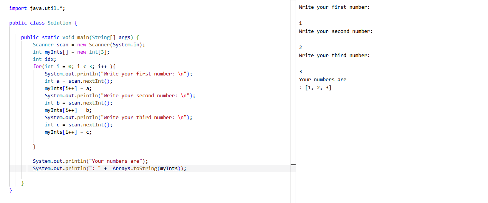
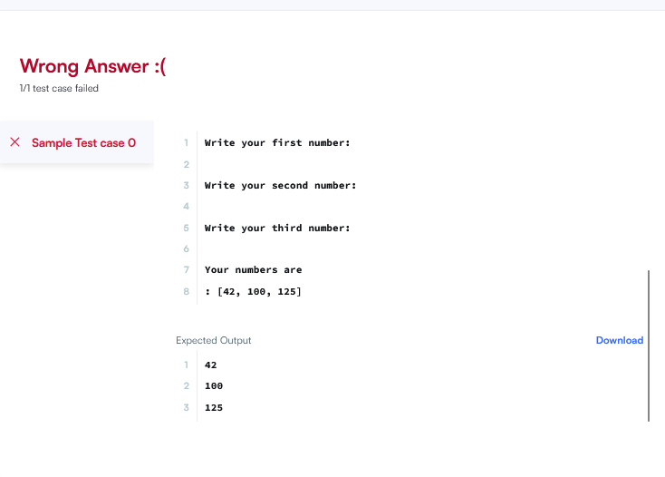
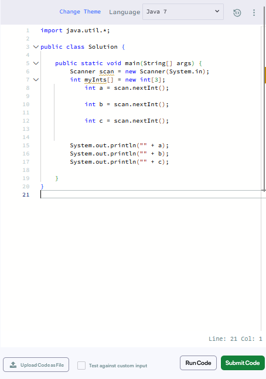

## :) da um ligue em outras maneiras de resolver alguns exercícios do hackrank com essas prints de cria.

*obs: por enquanto é só java, logo menos farei para C, :)

### Exercício 1 - Aqui está nos ensinando a utilizar o system.in e system.output, mas aqui você aprende além, e se pudéssemos usar arrays?



```
Explain dos amigos:

import java.util.*;

public class Solution {

    public static void main(String[] args) {
        Scanner scan = new Scanner(System.in);
        int myInts[] = new int[3];
        int idx;
        for(int i = 0; i < 3; i++ ){
            System.out.println("Write your first number: \n");
            int a = scan.nextInt();
            myInts[i++] = a;
            System.out.println("Write your second number: \n");
            int b = scan.nextInt();
            myInts[i++] = b;
            System.out.println("Write your third number: \n");
            int c = scan.nextInt();
            myInts[i++] = c;
            
        }
        
        System.out.println("Your numbers are");
        System.out.println(": " +  Arrays.toString(myInts));
       
    }
}
 ```

_olha o chatão do compiler no hackerrank falando que não pode >: blébléblébléblé_



_resolução do chato_


```
Explain do chato: 
import java.util.*;

public class Solution {

    public static void main(String[] args) {
        Scanner scan = new Scanner(System.in);
        int myInts[] = new int[3];
            int a = scan.nextInt();
          
            int b = scan.nextInt();
         
            int c = scan.nextInt();
        
        
        System.out.println("" + a);
        System.out.println("" + b);
        System.out.println("" + c);
       
    }
}

```
